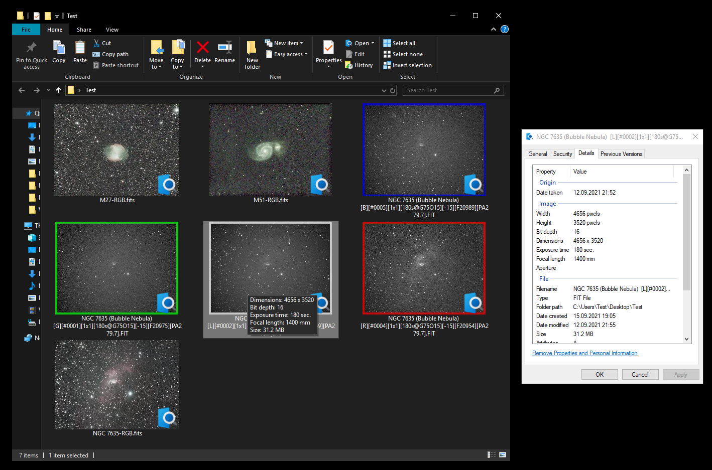

# FITS Explorer Extension

This application enables the Windows Explorer to show thumbnails for .fit/.fits/.fts images which are commonly used in astrophotography.

##### Features
- Auto stretch based on the PixInsight algorithm
- Auto debayer if the CFA pattern is specified in the FITS header ("BAYERPAT")
- Exposes FITS header information (e.g. exposure time, aperture, etc.) to file tooltips and the file properties details page
- Color-coded outlines on mono images if the FITS header specifies the (LRGB) filter type

## Development
##### Prerequisites
- [Visual Studio 2017](https://visualstudio.microsoft.com/) (or newer) with MSVC++ build tools component (v14.16+)
- [WiX Toolset](https://wixtoolset.org/releases/) and its extension for Visual Studio

##### Sub-projects
- `cfitsio`: FITS loader library with some modifications to enable loading FITS from IStream.
- `shellextension`:  Main code of the application including FITS loading, image processing, COM server, etc.
- `installerdll`: Some [custom actions](https://docs.microsoft.com/en-us/windows/win32/msi/custom-actions) needed by the installer.
- `installer`: WiX installer project to build .msi installers.
- `installerbundle`: WiX installer bootstrapper project. Combines the x86, x64 and vcredist installers into one single installer.

##### Building
- Build the `installer` project for x86 and x64 (may require Visual Studio to be launched as administrator in order for the [WiX Heat](https://wixtoolset.org/documentation/manual/v3/overview/heat.html) build step to work). The installer bundle in the next step will require both to be available.
- Build the `installerbundle` project. The resulting .exe can be found in `installerbundle/bin/{Release|Debug}/`.

You can use the Batch Build feature to automate the full build. If you only build this project for yourself and already have the correct vcredist installed you can skip the installer bundle and directly use the .msi installers.

## License

This project is released under the GNU Lesser General Public License v2.1.
Third party libraries and code used in this project:

- [cfitsio](https://github.com/healpy/cfitsio/blob/master/License.txt): Loading/parsing FITS files.
- [QuickLook.Plugin.FitsViewer](https://github.com/siyu6974/QuickLook.Plugin.FitsViewer): Implementation of PixInsight stretch. Licensed under LGPL v2.1.
- [Windows classic samples](https://github.com/microsoft/Windows-classic-samples): Samples for Windows COM servers and shell extensions. Licensed under the MIT License.

## Demo
